# 线性代数知识点总结

# 1 概念总结

## 1.1 方程组和矩阵

### 1.11 线性方程组

矩阵刚被发明时是用来解线性方程组的，线性方程组就是一组n元一次方程，形如
$\begin{cases}a_1x+b_1y+c_1z=d_1\\a_2x+b_2y+c_2z=d_2\\a_3x+b_3y+c_3z=d_3\end{cases}$

$a_{1...3},b_{1...3},c_{1...3}$为系数，$x,y,z$为未知数，所以线性方程组也可以表示为$Au=d$，其中$A$为$$\begin{pmatrix}
a_1&b_1&c_1\\
a_2&b_2&c_2\\
a_3&b_3&c_3
\end{pmatrix}$$
矩阵，也就是该方程组所有系数组成的矩阵，$u$为未知数矩阵$$\begin{pmatrix}
x\\
y\\
z
\end{pmatrix}$$，$d$为方程值矩阵$$\begin{pmatrix}
d_1\\
d_2\\
d_3
\end{pmatrix}$$

### 1.12 矩阵的初等变换

初等变换有行变换和列变换，其中每种变换都有三种操作，为倍乘，交换和倍乘加。这六种操作就是化简线性方程组的操作，且这些操作不会改变该方程组的解集，一般来说，我们只使用行变换的操作就行。

对矩阵使用初等变换可以换成阶梯型矩阵和最简型矩阵。
化成阶梯型矩阵的方法就是：
1. 从左边列开始，将其中最小的元素所在的行移到第一行，然后使用初等变换将该列的其他元素化为0。
2. 再到第二列，也是找除去第一行的最小元素并移动到第二行，将该列除了该行和第一行的其他元素化为0。
3. 再到第三列，第四列等直到最后一列或者已经处理到了最后一行，并重复第二步的对应步骤，也就是从左到右，从上到下。
4. 最后化成了上三角矩阵。

化成最简型矩阵的方法就是：
1. 先化成阶梯型矩阵。
2. 然后从右到左，从下到上的先将主对角线的非0元素都化为1，然后将主对角线的非0元素上面的非0元素都化为0。
3. 最后化成了三角矩阵。

### 1.13 方程组的解

化成最简型矩阵后，所有主对角线的非0元素对应的列就为主元列，每个主元列对应的未知数就是基本变量，其他列对应的未知数为自由变量。方程组有唯一解等价于该方程组对应的系数矩阵没有自由变量，存在自由变量等价于方程组有多个解。

如果方程组的所有方程右边的值全为0，则为线性齐次方程组，如果线性齐次方程组的解全为0，则称为平凡解，否则称为非平凡解。
可以看出，线性齐次方程组的解为平凡解等价于该齐次方程组没有自由变量，解为非平凡解等价于该齐次方程组存在自由变量。
对于解非线性齐次方程组$Ax=b$时，我们可以把非线性齐次方程组的解看做为线性齐次方程组$Ax=0$的通解加上$Ax=b$的一个特解$p$的和，从几何上来说，$Ax=b$的解集是一条通过$p$而平行于$Ax=0$的解集的直线。

### 1.14 矩阵的逆和行列式

对于$n{\times}n$方阵A来说，如果该方阵没有自由变量，则其通过初等变换成的最简型矩阵就是$n{\times}n$单位矩阵I，该初等变换的所有操作形成的矩阵B就是A的逆矩阵，也就是矩阵A的倒数，且A也是B的逆矩阵，也就是
$A^{-1}=B,B^{-1}=A,AB=BA=I$。
对于可逆矩阵A，$(A^{T})^{-1}A^{T}=A^{T}(A^{T})^{-1}=I$

只有方阵才有行列式，行列式可以判断一个方阵是否可逆，一个方阵A可逆等价于该方阵的行列式值不为0，否则不可逆，可逆矩阵被称为非奇异矩阵，不可逆矩阵被称为奇异矩阵。

对于二阶$2{\times}2$方阵$A=\begin{pmatrix}a&b\\c&d\end{pmatrix}$来说，可以直接计算套公式$detA=ad-bc,A^{-1}=\frac{1}{ad-bc}\begin{pmatrix}d&-b\\-c&a\end{pmatrix}$计算出该方阵的行列式$detA$和逆矩阵$A^{-1}$。
对于其他阶方阵来说，方阵的行列式可由公式$detA=(-1)^{r}u_{11}\cdots u_{nn}$得出，其中$r$为初等变换所用的行/列交换次数，$u_{11}\cdots u_{nn}$为其化为阶梯型的主对角线元素（此时初等变换不能使用行/列倍乘操作）；逆矩阵$A^{-1}$可由公式$\begin{pmatrix}A&I\end{pmatrix}=\begin{pmatrix}I&A^{-1}\end{pmatrix}$推导出，其中A为$n{\times}n$可逆矩阵，I为$n{\times}n$单位矩阵。

在几何上，矩阵$A=\begin{pmatrix}u_1u_2\end{pmatrix}$的行列式的值表示的是向量$u_1,u_2$这两个向量所围成的面积。

## 1.2 向量和向量空间

### 1.21 向量及向量空间的定义

在线代中，列向量就是形如$\begin{pmatrix}a\\b\\c\\
\vdots\\n\end{pmatrix}$的$n{\times}1$矩阵，简称向量。
如含有2个元素的向量为$\begin{pmatrix}a\\b\end{pmatrix}$，其中$a,b$为任意实数，所有含有2个元素的向量的集记为$R^2$，这就是一个向量空间，$R$表示向量中的元素是实数，而指数2表示每个向量包含2个元素。零向量就是元素值全为0的向量。

两个向量相等必须是这两个向量的长度，每个位置对应的元素的值都相等才相等，所以向量是有序元素的集合。

### 1.22 线性组合与线性关系

$m{\times}n$矩阵$A=\begin{pmatrix}v_1&v_2&v_3&\cdots&v_n\end{pmatrix}$（其中$v_1 v_2 v_3 \cdots v_n$为矩阵A的列向量）对$n{\times}1$向量$x$的线性组合$b$(也就是$Ax=b=c_1v_1+c_2v_2+c_3v_3+\cdots+c_nv_n$，其中$c_1,c_2,c_3,\cdots,c_n$为系数)也为一个$n{\times}1$向量。
如果矩阵A的各个列的向量中，如果存在一个向量是其他向量的线性组合，则称矩阵A的各个列的向量是线性相关的，否则称矩阵A的各个列的向量是线性无关。
矩阵A的各个列的向量是线性相关的也就相当于矩阵A的主元列小于该矩阵的行数，也就是存在自由变量。

若$\{v_1,v_2,v_3,\cdots,v_p\}$是向量空间$R^n$的向量，则$\{v_1,v_2,v_3,\cdots,v_p\}$的所有线性组合所成的集合可以用记号$Span\{v_1,v_2,v_3,\cdots,v_p\}$来表示，称为由$\{v_1,v_2,v_3,\cdots,v_p\}$所生成（或张成）的$R^n$的子集。

### 1.23 向量空间的子空间

向量空间$R^n$的某组向量以及这些向量的倍乘向量以及这些其中任意两个向量的加法向量和零向量的集合被称为$R^n$的子空间，所以$Span\{v_1,v_2,v_3,\cdots,v_p\}$可以被称为由$\{v_1,v_2,v_3,\cdots,v_p\}$所生成的子空间。

子空间$H$中的任意一组线性无关且**能生成H**的向量$\{v_1,v_2,v_3,\cdots,v_p\}$(其中$0<=p<=n$)都可以看作为该子空间中的一个基，其中子空间中的每个$p{\times}1$向量$x$都可以看作为该子空间中的基的线性组合(也就是$x=c_1v_1+c_2v_2+c_3v_3+\cdots+c_pv_p$，其中$c_1,c_2,c_3,\cdots,c_p$为系数)。

仅含零向量的子空间叫做零子空间。一个非零子空间的维度为该子空间基所含向量的数目，零子空间的维度为0，所以向量空间$R^n$包含向量空间$R^p$(其中$0<=p<=n$)。

矩阵$A$的零空间是齐次方程$Ax=0$的所有解的集合，记为$NulA$，$NulA$的维度为对应齐次方程$Ax=0$的自由变量的个数。

### 1.24 子空间的基

简单来说，可以将一个$R^n$的子空间$H$看作为一个p维空间(其中$0<=p<=n$)，该p维空间中的$p{\times}1$向量可以有多种坐标系来进行参照，每种坐标系就是子空间$H$的一个基，基中的每个列向量就代表坐标系中的坐标轴，用于表示方向。子空间$H$的$p{\times}1$向量$x$可以用该子空间上的基**唯一**线性组合表示（也就是用同子空间的不同的基对向量进行表示时，所有线性组合表示的对应系数是一样的)，也就是用该p维空间的坐标系的各个坐标轴的分量之和来唯一表示，比如子空间$H$上的基是$\{v_1,v_2,v_3,\cdots,v_p\}$，则向量$x$表示为$x=c_1v_1+c_2v_2+c_3v_3+\cdots+c_pv_p$，其中$c_1 c_2 c_3 \cdots c_p$，其中$c_1,c_2,c_3,\cdots,c_p$是系数。

一个$m{\times}n$矩阵A可以用来表示$R^m$子空间$H$上的一个基，其中矩阵A中的所有主元列$\{v_1,v_2,v_3,\cdots,v_p\}$构成了该基(其中$0<=p<=m$)，所以该子空间上的向量$x$可以用$Ac=x=c_1v_1+c_2v_2+c_3v_3+\cdots+c_pv_p$表示，其中向量$c=\begin{pmatrix}c_1\\c_2\\c_3\\\vdots\\c_p\end{pmatrix}$称为$x$相对于A的坐标向量。

### 1.25 维度与秩

A的秩就是A的列空间的维度，也就是其主元列的数量，A为满秩也就是指A的主元列数量等于其列数。

由此结合线性方程组的相关知识，我们可以得出有关$Ax=b$(A为$m{\times}n$系数矩阵，x为$n{\times}1$解向量，b为$m{\times}1$值向量)解的结论：
1. $Ax=b$有唯一解等价于矩阵A构成的$R^m$子空间$H$的维度为m，且向量b在$H$上。
2. $Ax=b$有无穷多的解等价于矩阵A构成的$R^m$子空间$H$的维度小于m，且向量b在$H$上。
3. $Ax=b$无解等价于向量b不在矩阵A构成的$R^m$子空间$H$上。

### 1.26 内积与内积空间

在线代中，内积(也叫做点积)定义的是一种使向量空间中的任何向量对于内积操作都支持交换，结合和分配率的运算操作，定义了内积的向量空间叫做内积空间。
标准内积的定义：假设$R^n$中有两个$n{\times}1$向量$u=\begin{pmatrix}u_1\\u_2\\u_3\\\vdots\\u_n\end{pmatrix},v=\begin{pmatrix}v_1\\v_2\\v_3\\\vdots\\v_n\end{pmatrix}$，则$u\cdot v=\begin{pmatrix}u_1u_2u_3\cdots u_n\end{pmatrix}\begin{pmatrix}v_1\\v_2\\v_3\\\vdots\\v_n\end{pmatrix}=u_1v_1+u_2v_2+u_3v_3+\cdots+u_nv_n$。

### 1.27 长度与距离

向量$v=\begin{pmatrix}v_1\\v_2\\v_3\\\vdots\\v_n\end{pmatrix}$的长度$||v||$定义：$||v||=\sqrt{v\cdot v}=\sqrt{v_1^2+v_2^2+v_3^2+\cdots+v_n^2}$，且$||v||^{2}=v\cdot v$

$R^n$中向量$u,v$之间的距离$dist(u,v)=||u-v||$，表示向量$u-v$的长度。

如果向量$u,v$是$R^2$或$R^3$中的向量，则它们之间的夹角$\theta$可以通过公式$u\cdot v=||u||\,||v||cos\theta$来计算。

### 1.28 正交与正交基

正交的定义：$u\cdot v=0$，则称向量$R^n$中的两个向量$u,v$是（相互）正交的。零向量与向量$R^n$中的任意向量都正交。

两个向量$u,v$正交的充要条件为$||u||^{2}+||v||^{2}=||u+v||^{2}$。

标准基就是一组由多个0和一个1组成的向量的线性无关集合；正交基就是一组两两之间都正交的向量的线性无关集合；标准正交基(单位正交基)就是一组正交基，且每个基向量的长度为1。
正交基的好处就是用于表示某个向量时，该线性组合表示中的系数可以直接用公式求出，比如正交基$\{u_1,u_2,u_3,\cdots,u_n\}$用于表示$n{\times}1$向量$x=c_1u_1+c_2u_2+c_3u_3+\cdots+c_nu_n$时，系数$c_j$的值为$c_j=\frac{x\cdot u_j}{u_j\cdot u_j}$，其中符号$\cdot$为内积，$1<=j<=n$。

假设$R^n$子空间$H$的维度为n，则该子空间的基可以表示为$\{v_1,v_2,v_3,\cdots,v_n\}$，该子空间上的$n{\times}1$向量$x$可以表示为$x=c_1v_1+c_2v_2+c_3v_3+\cdots+c_nv_n$，其中$c_1,c_2,c_3,\cdots,c_n$为系数。
对于由基为$\{s_1,s_2,s_3,\cdots,s_p\}$(其中$0<=p<=n$)的子空间子空间$S$，$n{\times}1$向量$x$在$S$上的投影可以表示为$\hat{x}=a_1s_1+a_2s_2+a_3s_3+\cdots+a_ns_n$，其中$a_1,a_2,a_3,\cdots,a_n$为系数；如果基$\{u_1,u_2,u_3,\cdots,u_p\}$为$S$的正交基，则$n{\times}1$向量$x$在$S$上的正交投影为$\hat{x}=a_1u_1+a_2u_2+a_3u_3+\cdots+a_nu_n$，其中$a_1,a_2,a_3,\cdots,a_n$为系数，且$a_j=\frac{x\cdot u_j}{u_j\cdot u_j}$，其中符号$\cdot$为内积，$1<=j<=n$。

我们可以使用格拉姆——斯密特方法将任何非正交基转换为正交基，该方法主要利用的原理是公式$y=\hat{y}+z$，其中$\hat{y}$是向量$y$的正交投影，$z$是垂直于向量$\hat{y}$的向量。
对于一个方阵U来说，如果该方阵的所有列向量可以构成一个单位正交基，则该方阵U被称为正交矩阵，也就是具有$U^{T}U=I$的性质，其中I为单位矩阵。所有的正交矩阵都是可逆的，且其所有行向量也可以构成一个单位正交基。

## 1.3 线性变换

### 1.31 线性变换介绍

矩阵还可以对向量进行变换，$m{\times}n$矩阵将$n{\times}1$向量映射成该矩阵组成的$R^m$子空间$H$上的某个$m{\times}1$向量，这种操作叫作线性变换。比如$Ax=y$就是$m{\times}n$矩阵A将$n{\times}1$向量$x$变换成$m{\times}1$向量$y$。

线性变换在几何上可以表示为某点的运动结果，比如对于点$x=(2,5)$来说，矩阵$A=\begin{pmatrix}3&0\\0&1\end{pmatrix}$对其的线性变换$Ax=\begin{pmatrix}3&0\\0&1\end{pmatrix}\begin{pmatrix}2\\5\end{pmatrix}=\begin{pmatrix}6\\5\end{pmatrix}$就是将点$x$移动到位置$(6,5)$。

### 1.32 线性变换性质

线性变换支持向量的加法和标乘运算规则。线性变换的矩阵A满足单射等价于A是没有自由变量的，满射等价于A对$R^m$的每个向量都有解。

## 1.4 仿射变换与几何学

### 1.41 仿射组合

仿射组合是线性组合的一种特殊形式，对于$R^n$中的向量$v_1,v_2,v_3,\cdots,v_p$来说，这些向量组合的一个仿射组合$y=c_1v_1+c_2v_2+c_3v_3+\cdots+c_pv_p$，其中$c_1,c_2,c_3,\cdots,c_p$是系数且满足$c_1+c_2+c_3+\cdots+c_p=1$，$y$是点(向量)。
定义集合$S$中点的所有仿射组合组成的集合称为$S$的仿射包，记为$aff\ S$。

对于单点$v_1$的仿射包就是集合${v_1}$，形式为$y=c_1v_1$；而两个点的仿射包${v_1,v_2}$的形式为$y=c_1v_1+c_2v_2=(1-t)v_1+tv_2=v_1+t(v_2-v_1)=p+tu$，其中$t=c_2,t\in R,\ p=v_1,u=v_2-v_1, u\in Span\{u\}$，所以两个点的仿射包${v_1,v_2}$可以看成朝某方向上($p$)对直线(向量)$u$进行的一个平移；而对于其他大于2个点的仿射包来说，它们就是表示对某向量进行的平移，尤其对于3个点的仿射包来说，其表示对某平面进行的平移。

所以对于任意实数$t$和某集合$S$，如果$(1-t)p+tq \in S$，其中$p,q\in S$，则该集合$S$是仿射的，这也就说明当且仅当$S=aff \ S$时，集合$S$是仿射的。

仿射组合与线性组合的关系：
1. 对于$R^n$中的任意小于等于$n$的数量的向量$v_1,v_2,v_3,\cdots,v_p$来说，点(向量)$y,y\in R^n$是这些向量的仿射组合等价于平移点(向量)$y-v_1$是向量$v_2-v_1,v_3-v_1,\cdots,v_p-v_1$的线性组合。
2. 对于$R^n$中的任意小于等于$n$的数量的向量$v_1,v_2,v_3,\cdots,v_p$来说，点(向量)$y,y\in R^n$是这些向量的仿射组合$y=c_1v_1+c_2v_2+c_3v_3+\cdots+c_pv_p$（其中$c_1+c_2+c_3+\cdots+c_p=1$）等价于$\widetilde{y}=c_1\widetilde{v_1}+c_2\widetilde{v_2}+c_3\widetilde{v_3}+\cdots+c_p\widetilde{v_p}$，其中$\widetilde{y}=\begin{bmatrix}y\\1\end{bmatrix},\widetilde{v_1}=\begin{bmatrix}v_1\\1\end{bmatrix},\widetilde{v_2}=\begin{bmatrix}v_2\\1\end{bmatrix},\cdots,\widetilde{v_p}=\begin{bmatrix}v_p\\1\end{bmatrix}$，$\widetilde{y},\widetilde{v_1},\widetilde{v_2},\cdots,\widetilde{v_p}\in R^{n+1}$指的是向量$y,v_1,v_2,\cdots,v_p$的标准齐次形式（这种形式方便用于升维计算）。

所以对于一个点(向量)是否是$R^n$中向量$v_1,v_2,v_3,\cdots,v_p$的仿射组合，可以采用平移到原点(定理1)或者化成标准齐次形式(定理2)的方法来求増广矩阵是否有解来判断，并得出该点的各个权值。

在几何学中，$R^n$中的一个集合$S$被向量$p$平移后的集合表示为$S+p=\{s+p:s\in S\}$，而$R^n$的一个平面被表示为子空间的一个平移。
如果一个平面是另一个平面的平移，而这两个平面是平行的。平面的维数是对应的平行的子空间的维数(也就是平移前的子空间)，而一个集合$S$的维数记为$dimS$，是包含$S$的最小平面的维数。所以$R^n$中一条直线就是维数为1的平面，而$R^n$中的一个超平面是维数为n-1的平面。
非空集合$S$是一个平面等价于该集合是仿射的。

### 1.42 仿射关系

对于仿射概念来说，和线性概念一样，也存在仿射相关和仿射无关的概念。
对于$R^n$中的某指标点集(集合)$S=\{v_1,v_2,v_3,\cdots,v_p\}$来说，如果存在某一个向量$v_k$是其他向量的仿射组合，则称该集合$S$的向量是仿射相关的，否则称该集合$S$的向量是仿射无关的。

因为仿射组合是线性组合的一种特殊情形，是有着特殊限制条件的线性相关，所以每一个仿射相关集合都是线性相关的。
$R^n$中的集合$S=\{v_1,v_2,v_3,\cdots,v_p\}$仿射相关等价于$R^n$集合$\{v_2-v_1,v_3-v_1,\cdots,v_p-v_1\}$线性相关，等价于$R^{n+1}$集合$\{\widetilde{v_1},\widetilde{v_2},\cdots,\widetilde{v_p}\}$线性相关。
所以验证一个集合是否是仿射相关，可以采用这两种性质来判断。

和线性无关集的概念一样，仿射也有仿射无关集的概念：
$R^n$中的仿射无关集$S=\{v_1,v_2,v_3,\cdots,v_p\}$对于$aff\ S$中每一个向量$p$都有**唯一**的仿射组合表示，也就是对于每一个向量$p$，存在唯一的标量集(系数)$c_1,c_2,c_3,\cdots,c_p$，使得$p=c_1v_1+c_2v_2+c_3v_3+\cdots+c_pv_p$，其中$c_1+c_2+c_3+\cdots+c_p=1$。
向量$p$的唯一表达式中的标量集(系数)$c_1,c_2,c_3,\cdots,c_p$也被称为$p$的重心坐标。

### 1.43 凸组合

凸组合是另一种特殊的线性组合，它在仿射组合的基础上进一步对线性组合做出了限制，限制这些组合的权值为非负值。

对于$R^n$中的向量$v_1,v_2,v_3,\cdots,v_p$来说，这些向量组合的一个凸组合$y=c_1v_1+c_2v_2+c_3v_3+\cdots+c_pv_p$，其中$c_1,c_2,c_3,\cdots,c_p$是非负系数且满足$c_1+c_2+c_3+\cdots+c_p=1$，$y$是点(向量)。
定义集合$S$中点的所有凸组合组成的集合称为$S$的凸包，记为$conv\ S$。

除了单点$v_1$（该凸包与仿射包相同），其他的凸包真包含在仿射包中；对于两个点的凸包${v_1,v_2}$，其表示的是线段$\overline{v_1v_2}$的平移，而不是直线了，三个点的就表示某个面积的平移；当$p$的重心坐标为非负值时，$p\in convS$才成立。

对于集合$S$和任意实数$p,q\ \in S$，如果$\overline{pq}\in S$，则该集合$S$是凸的，这也就说明当且仅当$S=conv \ S$时，集合$S$是凸的。

如果$\{S_{\alpha}:\alpha\in A\}$是任一组凸集，则$\cap_{\alpha\in A}S_\alpha$是凸集；如果$\{T_{\beta}:\beta\in B\}$是任一组仿射集，则$\cap_{\beta\in B}T_\beta$是仿射集。

所以对于任何集合$S$，$S$的凸包是所有包含$S$的凸集的交集，这也就说明了$S$的凸包是包含$S$的最小凸集。

我们可以用以下定理来减少构成凸组合的点：
Caratheodory定理：如果$S$是$R^n$中的一个非空子集，则$S$的凸包中的每一点可以由$S$中n+1个或者更少的点的凸组合来表示。
对于可以减少构成凸组合的点的集合$S$来说，它必定是仿射相关的（因为某点可以去掉，就表明该点可以由其他店的仿射组合来表示），所以对于减少构成凸组合的点，我们可以采用以下步骤：
1. 先得出集合$S$的一个仿射相关关系式。
2. 选择仿射相关关系式中系数为正的最大值$max$，用该值除以凸组合中的各个系数，找到这些系数中的非负数的最小值$min$，用凸组合减去$min$乘仿射相关关系式的式子，这样就减少了一个点。
3. 重复上述步骤直到构成凸组合的点为n+1个。

### 1.44 超平面

超平面的主要作用是可以将某空间切分成两个不相交的部分，比如一个平面可以将$R^3$分成两部分，一条直线将$R^2$分成两部分等，对于超平面来说，直线平面等主要用隐式表达方式（向量形式的通解表达法）而不是显式表达。

直线平面等的隐式表达方式将它们描述为一个线性表达式(线性函数)，严格来说，$R^n$上的一个线性函数是从$R^n$到$R$的一个线性变换$f$，对$R$中的每个标量$d$，符号$[f:d]$表示$R^n$中使得$f$的值为$d$的所有$x$的集合，即$[f:d]=\{x\in R^n:f(x)=d\}$。
对$R^n$中所有点$x$都有$f(x)=0$的线性函数称为零函数，除零函数之外的其他函数称为非零函数。

由此可见$[f:0]=\{x\in R^n:Ax=0\}=NulA$，其中$A$是$f$的线性变换$1\times n$矩阵。因为$dim\ NulA=n-1$，对于$[f:d]$中任意的$p$，都有$[f:d]=\{x\in R^n:Ax=d\}=[f:0]+p$，所以集合$[f:d]$和$[f:0]$是平行的超平面。

此外$[f:d]=\{x\in R^n:Ax=d\}=\{x\in R^n:n\cdot x=d\}$，$[f:0]=\{x\in R^n:Ax=0\}=\{x\in R^n:n\cdot x=0\}$，其中$n\cdot x, n\in R^n$是内积，所以$n$可以称为$[f:0]$的法向量，且$n$正交于每个与$[f:0]$平行的超平面$[f:d]$。
$[f:d]$也可以称为$f$的水平集，所以当$\forall x\in R^n, f(x)=n\cdot x$时，$n$可以称为$f$的梯度。
所以$R^n$中的子集$H$是超平面当且仅当$H=[f:d]=\{x:n\cdot x=d\}$。

对于线性函数$f$以及常数$d$的求解，一般是通过$n$正交于$[f:0]$的性质先求出$n$，然后代入$Ax=n\cdot x=0$求得线性函数$f$，最后将已知点带入求得常数$d$，其中$n$的求解可以用叉积公式来求。

其中开集的凸包是开集，紧致集的凸包是紧致的，但闭集的凸包不一定是闭的。

如果超平面$H=[f:d]$满足下列条件之一：
* $f(A)\leq d$且$f(B)\geq d$
* $f(A)\geq d$且$f(B)\leq d$
则该超平面被分割成两个集合$A$与$B$，若以上关系条件的所有弱不等式变为严格不等式，则称$H$严格分割集合$A$与$B$。
严格分割需要两集合不相交，但不相交的两集合不一定能严格分割。

当且仅当$A\cap B=\empty$时，存在超平面$H$能严格分割两个非空凸集$A$与$B$，且$A$和$B$中，一个是紧致的，一个是闭的。
上面定理可以推出当且仅当$(conv\ A)\cap (conv\ B)=\empty$时，存在超平面$H$能严格分割两个非空紧致集$A$与$B$。

对于验证某超平面是否能分割集合$A$与$B$，我们可以先计算集合$A$与$B$的所有点在该超平面对应线性函数$f$的值，然后判断超平面的固定值是否能将这些值划分为不相交的两个集合，不能则该超平面就不能分割这两个集合。

## 1.5 特征值与特征向量

### 1.51 特征值与特征向量介绍

对于变换矩阵A为**方阵**的线性变换来说，有某些**非零向量**在经过线性变换后，其方向不会改变，只会改变其长度。这些向量也就是变换矩阵的特征向量，对应的长度伸缩比也就是变换矩阵的特征值，也就是$Av=\lambda v$(其中v为向量，$\lambda$为向量$v$对应的长度伸缩比)。

一般来说，矩阵A的特征值可能有多个，每个特征值对应的特征向量也可能有多个，对于矩阵A的特征值的求解，一般是让矩阵A对应的特征空间$(A-\lambda)x=0$有非平凡解，也就是让该方程有自由变量，所以矩阵$(A-\lambda)$的行列式必须为0，且该矩阵不可逆。所以我们通常是求$detA=0$的解(这也就是求特征方程的解)从而求出矩阵A的各个特征值，并求出各个特征值对应的特征向量。

### 1.52 特征向量的性质

同一矩阵的不同特征值之间的特征向量是线性无关的，同一特征值的不同特征向量之间可能是线性无关的。
之前谈到的特征值都是实特征值，也就是实数特征值，它们在几何上表示的是对特征向量长度的伸缩比；还有一种是复数特征值，简称复特征值，由实部和虚部组成，实部在几何上表示的是对特征向量长度的伸缩比，而虚部在几何上表示的是对特征向量角度的旋转。

### 1.53 矩阵相似性

有些矩阵的特征值是一样的，这也就反映了这些矩阵对某些向量的线性变换有着一样的伸缩变化，这些矩阵之间相互相似，也就是如果矩阵A和B相似，则存在可逆矩阵P，使得$B=P^{-1}AP,A=PBP^{-1}$

### 1.54 矩阵对角化

通过观察计算，我们可以发现三角矩阵和对角矩阵的特征值就是他们主对角线上的各个元素，如果一个矩阵相似于一个对角矩阵，则可以直接求出该矩阵的特征值了。不过不是所有的矩阵都有相似的对角矩阵，对于$n{\times}n$矩阵A，只有存在n个线性无关的特征向量，才能够进行对角化，也就是说A要么有n个不同的特征值，要么相同特征值对应的线性无关特征向量数量等于该特征值的重数。
将$n{\times}n$矩阵A转化为对应的对角矩阵的操作叫做对角化，也就是$A=P^{-1}DP$，其中P是可逆矩阵，D是对角矩阵。根据矩阵求特征值的方法，我们可以推导出，可逆矩阵P的列是矩阵A的n个线性无关特征向量，D的对角线元素是其对应特征向量的特征值，P和D之间的值一一对应，这样就完成了矩阵A的对角化。

## 1.6 对角化与二次型

### 1.61 矩阵正交对角化

矩阵的对角化有许多用途，其中最主要的用途还是用于二次型方面，对于对称矩阵A来说，A的不同特征值之间的特征向量是正交的，所以我们将A进行对角化$A=P^{-1}DP$时，可以使可逆矩阵P变为正交矩阵，这种对角化$A=P^{-1}DP=P^{T}DP$也就叫做正交对角化。

### 1.62 二次型介绍

而对称矩阵是用来表示二次型的，$R^n$上的二次型也就是一个定义在$R^n$上的n元二次函数，它在向量x处的值可以用表达式$Q(x)=x^{T}Ax$来计算，其中A是$n{\times}n$对称矩阵。
二次型的各个项的系数可以由对应的对称矩阵看出，其中矩阵主对角线上是二次型的二次项系数，其他的是其他项的系数的一半，比如二次型为$Q(x)=x^{T}\begin{pmatrix}6&2&1\\2&-5&-3\\1&-3&9\end{pmatrix}x$，则该二次型可以用多项式表达为$Q(x)=6x_1^2-5x_2^2+9x_3^2+4x_1x_2+2x_1x_3-6x_2x_3$

### 1.63 标准型

对于二次型$Q(x)=x^{T}Ax$来说，如果能够做一种变量代换，将式子中的所有非二次项的项的系数全化为0，则计算值将会方便的多，所以可以考虑变量代换$x=Py$或$y=P^{-1}x$，其中P是一个可逆矩阵，y是变换后的向量，使得$Q(x)=x^{T}Ax=y^{T}Dy$，从而将$Q(x)$的所有非二次项的项的系数全化为了0。这也就是对A进行对角化，而A是对称矩阵，所以经过计算变换可以得知，要使变量代换成功，则可逆矩阵P必须为由对称矩阵A的特征向量组成的正交矩阵，此时$Q(x)=x^{T}Ax=y^{T}(P^{T}AP)y=y^{T}Dy$。
所以使用变量代换$x=Py$或$y=P^{-1}x$，可以使得$Q(x)=x^{T}Ax=y^{T}(P^{T}AP)y=y^{T}Dy$，其中P为由对称矩阵A的特征向量组成的正交矩阵，变换后的二次型叫做标准型。

### 1.64  二次型的性质

二次型$Q(x)$的性质：
1. 正定型：对于所有的$x\neq0$，都有$Q(x)>0$，也就是$Q(x)$对应的矩阵的特征值都是正值。
2. 负定型：对于所有的$x\neq0$，都有$Q(x)<0$，也就是$Q(x)$对应的矩阵的特征值都是负值。
3. 不定型：对于所有的$x\neq0$，$Q(x)$有正有负，也就是$Q(x)$对应的矩阵的特征值有正有负。

# 2 应用总结

## 2.1 列昂惕夫投入产出模型

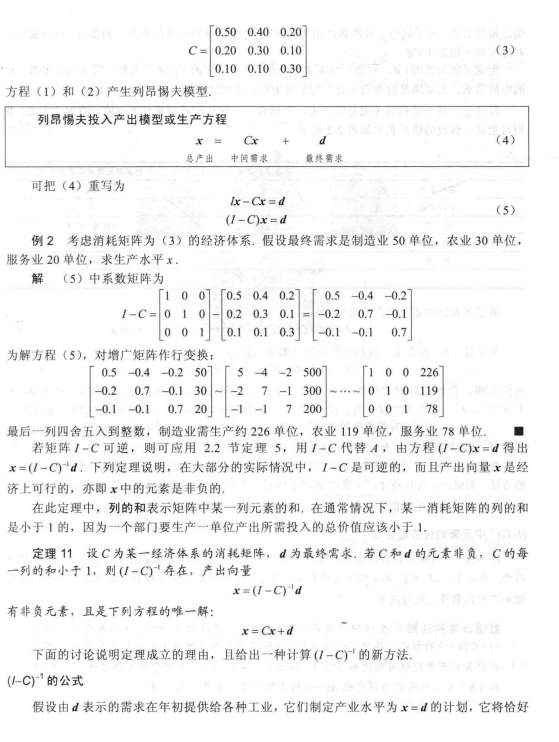
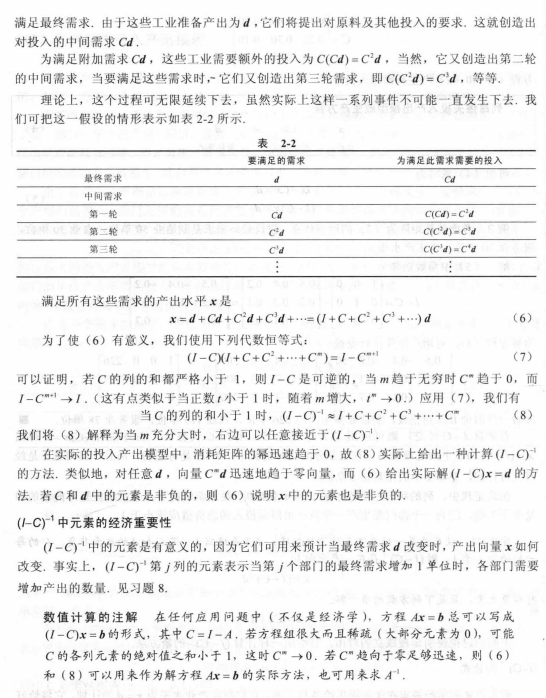

## 2.2 计算机图形学的应用

### 2.21 常用的二维变换矩阵

1. 对称变换
   * 关于x轴对称：$\begin{pmatrix}1&0\\0&-1\end{pmatrix}$
   * 关于y轴对称：$\begin{pmatrix}-1&0\\0&1\end{pmatrix}$
   * 关于直线$y=x$对称：$\begin{pmatrix}0&1\\1&0\end{pmatrix}$
   * 关于直线$y=-x$对称：$\begin{pmatrix}0&-1\\-1&0\end{pmatrix}$
   * 关于原点对称：$\begin{pmatrix}-1&0\\0&-1\end{pmatrix}$
2. 伸缩变换(其中k为伸缩系数)
   * 水平伸缩：$\begin{pmatrix}k&0\\0&1\end{pmatrix}$
   * 垂直伸缩：$\begin{pmatrix}1&0\\0&k\end{pmatrix}$
3. 剪切变换(其中k为剪切系数)
   * 水平剪切：$\begin{pmatrix}1&k\\0&1\end{pmatrix}$
   * 垂直剪切：$\begin{pmatrix}1&0\\k&1\end{pmatrix}$
4. 投影变换
   * 投影到x轴上：$\begin{pmatrix}1&0\\0&0\end{pmatrix}$
   * 投影到y轴上：$\begin{pmatrix}0&0\\0&1\end{pmatrix}$

### 2.22 多面体

### 2.23 曲线与曲面

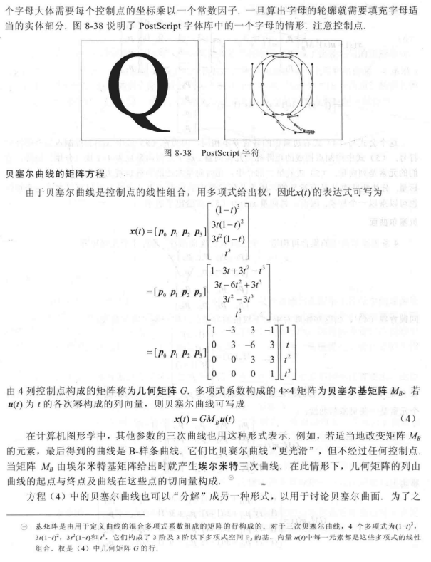

## 2.3 差分方程的应用

### 2.31 差分方程的一般应用

差分方程类型的题就是给出一个差分方程$x_{n+1}=Ax_{n}$和初值$x_{0}$，求出该差分方程的通项公式，其中$x_j(0<=j)$为向量，A为可对角化的矩阵。
我们可以通过差分方程看出$x_{n}=A^{n}x_0$，所以对于这类的题，我们要利用特征值的相关性质，将A用特征值来代替。

A可以对角化，所以A有n个线性无关的特征向量$\{v_1,v_2,v_3,\cdots,v_n\}$，这些特征向量也是在A所组成的子空间$H$上，所以对于$H$上的初始向量$x_0$，可以用这些特征向量组成的基来线性组合表示该向量，也就是$x_0=c_1v_1+c_2v_2+c_3v_3+\cdots+c_nv_n$，其中$c_1,c_2,c_3,\cdots,c_n$为系数。
然后根据差分方程和$Av=\lambda v$，可得$x_2=A^2x_0=A(c_1Av_1+c_2Av_2+c_3Av_3+\cdots+c_nAv_n)=c_1\lambda _1Av_1+c_2\lambda _2Av_2+c_3\lambda _3Av_3+\cdots+c_n\lambda _nAv_n=c_1\lambda _1^2v_1+c_2\lambda _2^2v_2+c_3\lambda _3^2v_3+\cdots+c_n\lambda _n^2v_n$
由此可得$x_k=c_1\lambda _1^kv_1+c_2\lambda _2^kv_2+c_3\lambda _3^kv_3+\cdots+c_n\lambda _n^kv_n \ (k=0,1,2,\cdots)$

所以对于这类题的解题步骤为：
1. 找出初值，并列出差分方程$x_{n+1}=Ax_{n}$。
2. 对矩阵A求出所有特征值以及对应的线性无关特征向量。
3. 利用式子$x_0=cv=c_1v_1+c_2v_2+c_3v_3+\cdots+c_nv_n$求出系数向量c，其中c为系数向量，v为由特征向量组成的基。
4. 将求出的系数向量c的值代入公式$x_k=c_1\lambda _1^kv_1+c_2\lambda _2^kv_2+c_3\lambda _3^kv_3+\cdots+c_n\lambda _n^kv_n \ (k=0,1,2,\cdots)$，至此已求出通项公式。

### 2.32 马尔科夫预测

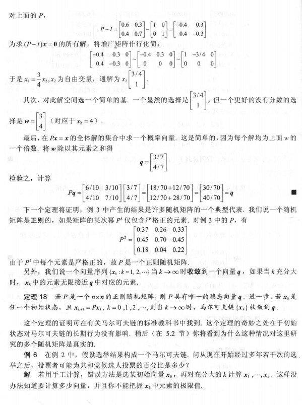
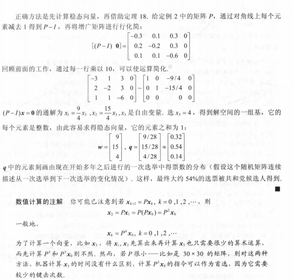

## 2.4 微分方程的应用

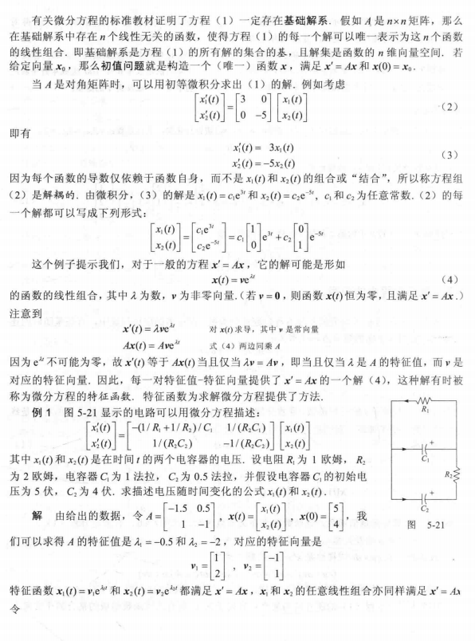
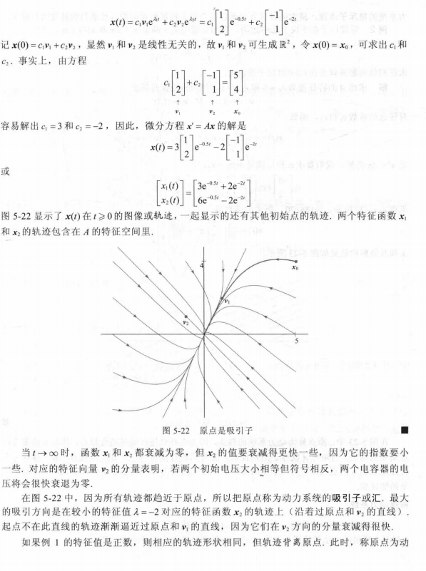
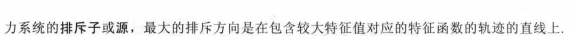

## 2.5 最小二乘问题

最小二乘问题也就是求方程近似解的问题，当方程组$Ax=y$无解时，证明了向量$y$不在A组成的子空间$H$上，我们就可以将向量$y$投影到子空间中，此时用向量$y$的投影$\hat{y}$代替向量$y$来求方程组$Ax=\hat{y}$，从而得出的解就是方程组$Ax=y$的近似解。

可以证明该近似解是离$Ax=y$的解最近的解，其中解的误差为$\epsilon=dist(y-\hat{y})$。

我们还可以直接使用公式$A^TAx=A^Ty$来求出近似解，因为该公式求出的解集与$Ax=\hat{y}$的相同。

### 2.51 回归分析

最小二乘问题最广泛的应用是回归分析，回归分析也就是给出一组数据点，根据这些数据点来判断和计算与其近似拟合的直线或曲线，这些直线或曲线就叫做回归直线或回归曲线。

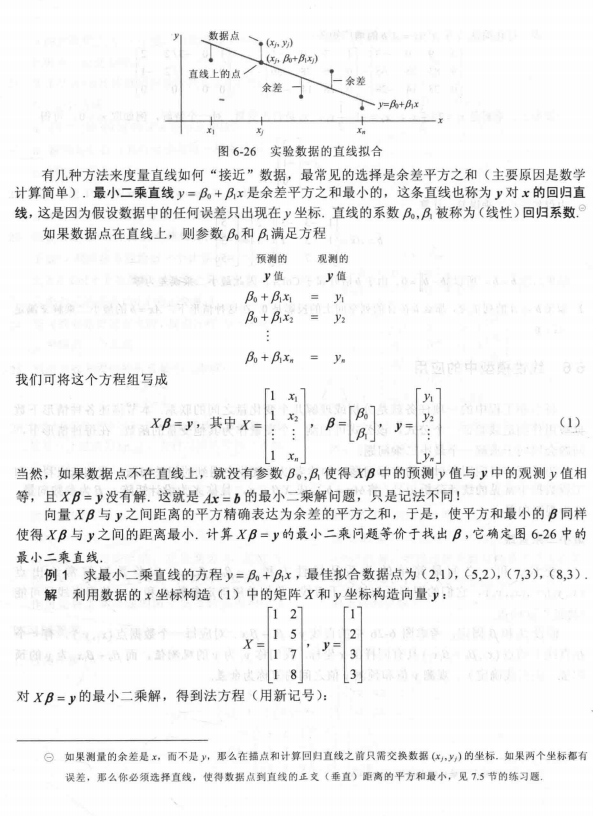
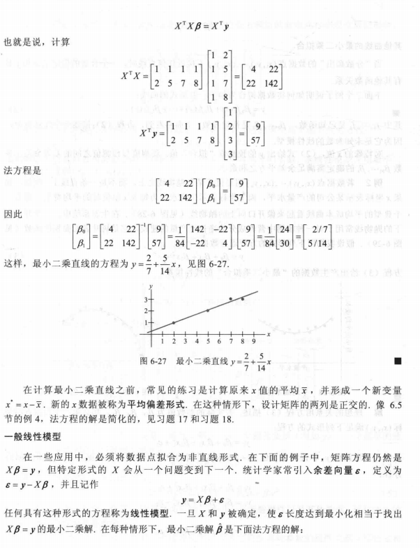
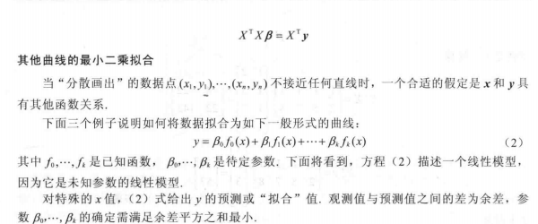

## 2.6 内积空间的应用

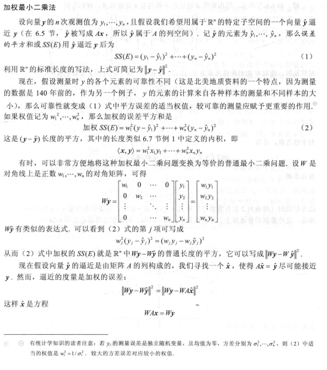

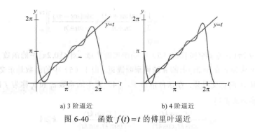

## 2.7 条件优化

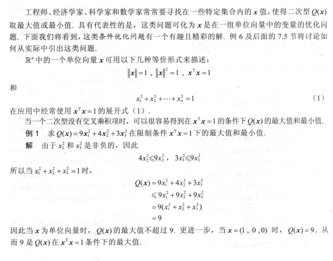
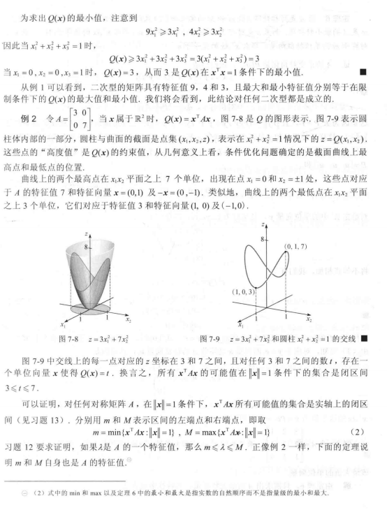

## 2.8 主成分分析

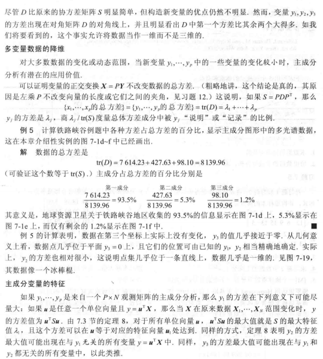

## 2.9 奇异值分解

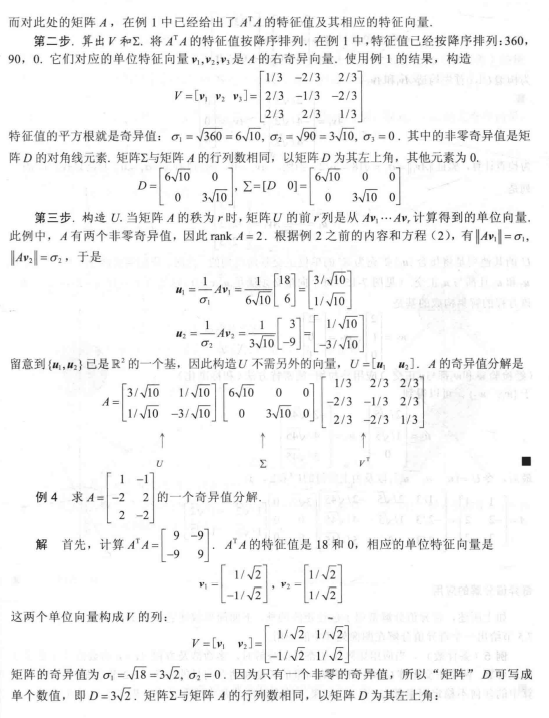
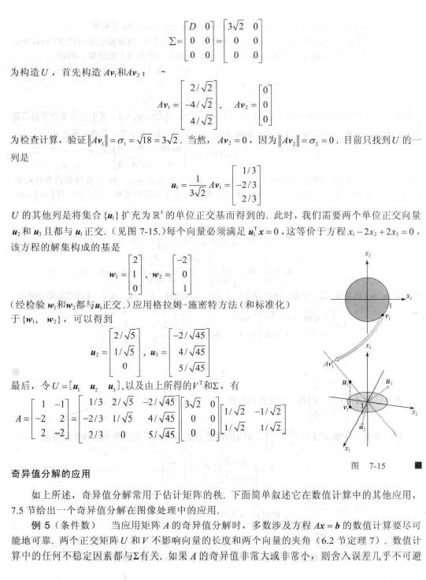

